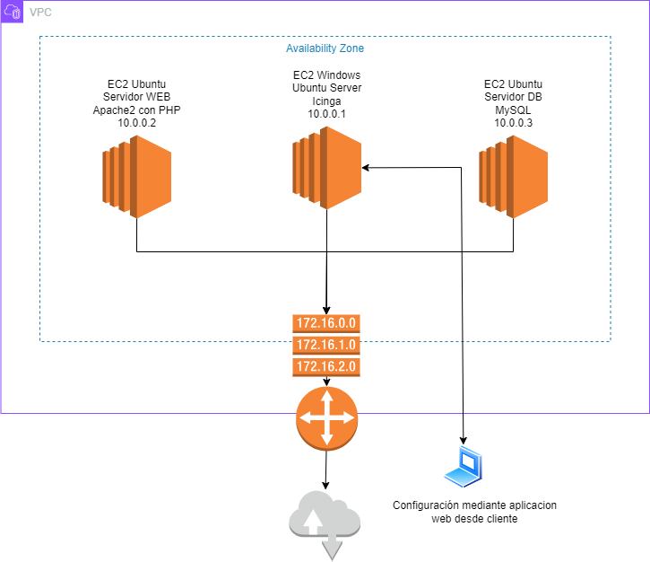
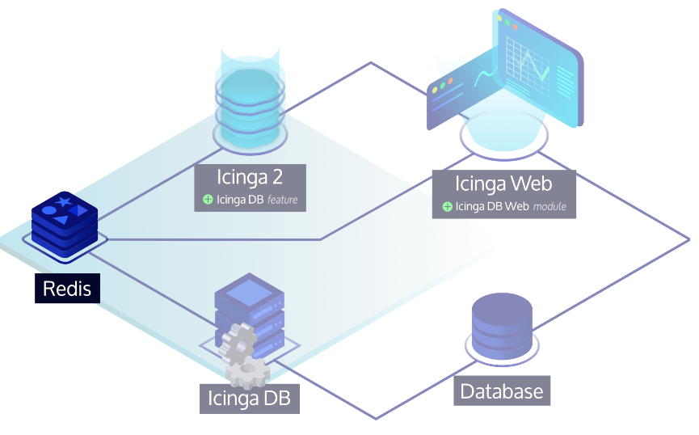
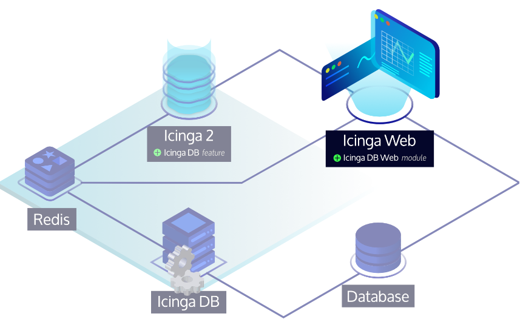
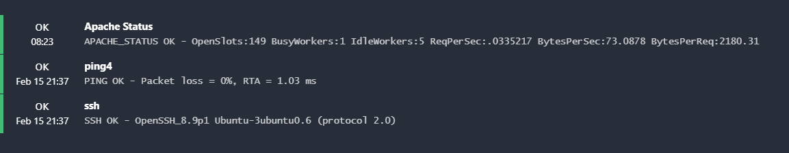
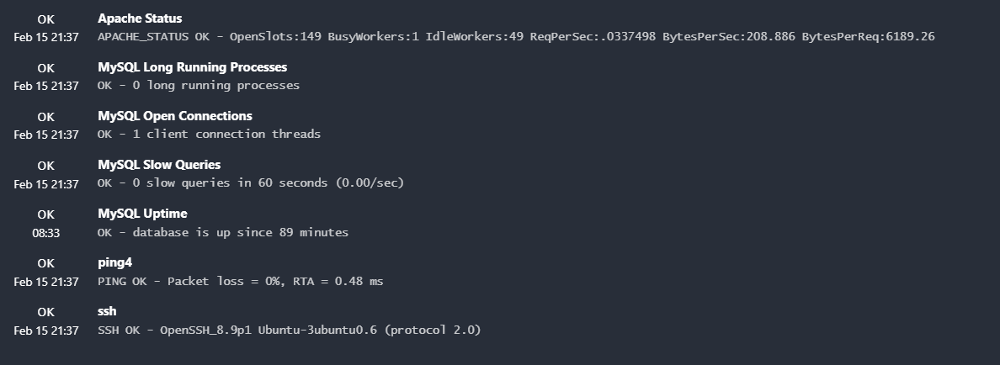
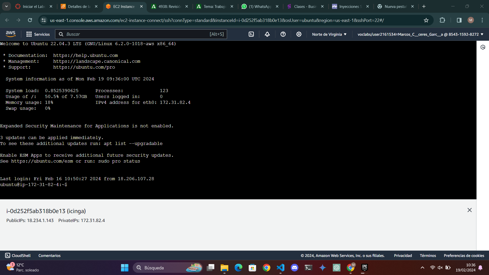
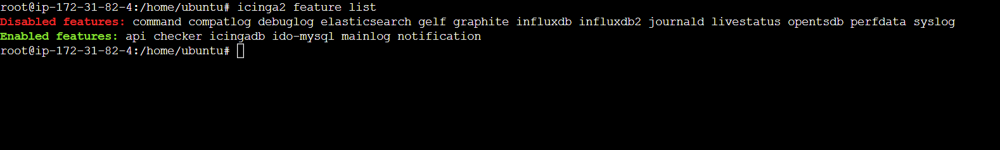
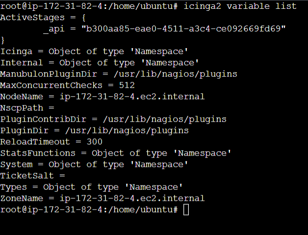
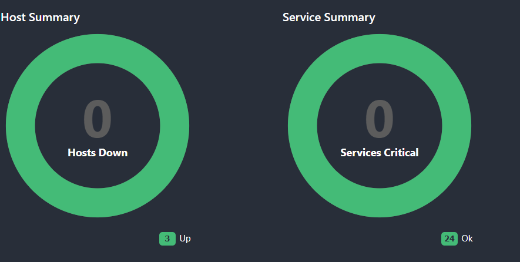
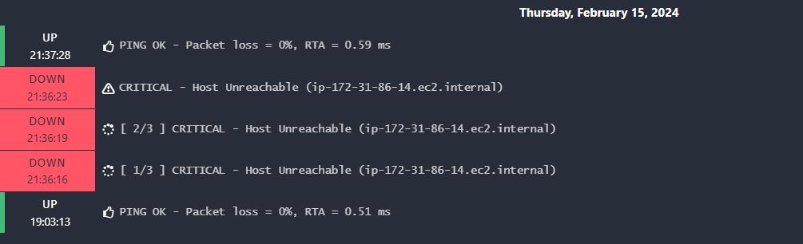

# ASO_TrabajoMonitorizacion

# 1  Las herramientas de monitorización de servidores.

## 1.1  Introducción general.

La monitorización de sistemas y estructuras de Tecnologías de la Información (TI) es un proceso fundamental para supervisar y analizar continuamente los componentes de una infraestructura informática, con el fin de detectar problemas y errores en tiempo real y poder resolverlos de manera efectiva. Esta práctica se lleva a cabo mediante el uso de herramientas y software especializado, que permiten recopilar, visualizar, analizar, correlacionar y alertar sobre datos de rendimiento del servidor, lo que facilita la detección y resolución efectiva de problemas. La monitorización de servidores es esencial para garantizar la disponibilidad, el rendimiento y la seguridad de los sistemas informáticos.

La monitorización de servidores abarca varios procesos fundamentales que se llevan a cabo a través de herramientas especializadas. Estos procesos incluyen la recopilación de datos, su visualización, análisis, correlación y generación de alertas. La recopilación de datos implica la obtención de información relevante desde distintas fuentes, que luego se almacena para su posterior análisis. Una vez recopilados, estos datos se visualizan y analizan para crear información útil en forma de métricas o indicadores clave de rendimiento (KPIs). La correlación de datos permite identificar relaciones entre diferentes eventos o parámetros, mientras que las alertas se generan cuando los valores obtenidos no se encuentran entre los límites correctos o no cumplen con los umbrales establecidos

Es importante tener un plan de monitorización bien definido en el que se especifiquen los objetivos, metas y parámetros a medir (KPIs), así como los umbrales de alerta a utilizar. Una vez establecido un plan de monitorización, se pueden seleccionar e implementar las herramientas adecuadas para recopilar y analizar datos sobre el rendimiento del servidor. La elección de las herramientas de monitorización adecuadas depende del tamaño del entorno a monitorear, los recursos disponibles y las necesidades específicas

La combinación de estas herramientas y un plan de monitorización eficaz es crucial para mantener un control en tiempo real sobre los sistemas y redes, lo que permite mitigar o solucionar problemas de manera efectiva. La detección temprana de problemas a través de la monitorización puede prevenir interrupciones en el servicio, pérdida de datos o vulnerabilidades en la seguridad. Por ejemplo, la detección anticipada de un aumento inusual en el uso del disco puede permitir tomar medidas preventivas antes de que se agote el espacio en disco, evitando así posibles interrupciones en el servicio

## 1.2  Las herramientas  a estudiar: ICINGA

 Icinga es una plataforma de monitoreo de código abierto que se utiliza para supervisar la disponibilidad y el rendimiento de los recursos informáticos, como servidores, redes, servicios y aplicaciones. Su nombre, Icinga, es una palabra zulú que significa "busca", "navega" o "examina" y se pronuncia con un chasquido consonántico.

Esta plataforma ofrece una flexibilidad, escalabilidad y capacidades avanzadas, que la ha convertido en una herramienta madura y ampliamente utilizada por administradores de sistemas y profesionales de TI. Sus características incluyen la generación de informes detallados, un sistema de alertas altamente personalizable y la capacidad de adaptarse a entornos diversos. Icinga es conocida por su capacidad para escalar desde implementaciones simples hasta despliegues complejos con miles de dispositivos monitoreados, lo que la hace atractiva para una amplia gama de usuarios en diversos sectores.

# 2  La herramienta XXX

## 2.1  Historia

Ichinga nacio el 6 de Mayo 2009, cuando un grupo de  miembros del anterior consejo asesor de la comunidad de Nagios, desarrolladores de numerosas extensiones de Nagios y personas de NETWAYS, el organizador de la Conferencia de Monitoreo de Nagios y proveedor de la plataforma MonitoringExchange (anteriormente NagiosExchange), anunciaron Icinga, como una nueva bifurcación del código, como respuesta a su descontento por el cuello de botella existente en ese momento en el desarrollo del software de Nagios, y su deseo de abrir su desarrollo a una base más amplia.
En su primer año, los desarrolladores de Icinga lanzaron versiones separadas del núcleo, API e interfaz web, y celebraron su descarga número 10,000. En 2010, el proyecto Icinga lanzó un núcleo e interfaz web unificados y estables; añadió soporte para la transición de IPv4 a IPv6, optimizó la conectividad de la base de datos y renovó la interfaz de usuario con su "Icinga Web", e integró varios complementos de la comunidad (PNP4Nagios, LConf, Heatmap y Business Process Addon) logrando más de 100,000 descargas y aumentado a 23 la cantidad de miembros del equipo.

Esta buena trayectoria como su potencial fueron respaldados con la inclusión por parte Jeffrey Hammond, de la empresa Forrester Research, en la lista de proyectos de código abierto "creciente" (en contraposición a "menguante").

En octubre de 2012, el proyecto Icinga presentó un avance tecnológico significativo: Icinga 2. Este fue un desarrollo paralelo y un reemplazo del marco de trabajo del núcleo original. Los desarrolladores de Icinga expresaron su intención de reescribir el núcleo para abordar problemas como la configuración complicada y las limitaciones de escalabilidad en implementaciones de gran tamaño. El proyecto también anunció planes para desarrollar el núcleo de Icinga 2 principalmente en lenguaje C++, diseñar una nueva arquitectura de cargador de componentes y remodelar el proceso de ejecución de las verificaciones de monitorización, pero esto no ocurrió hasta el 2014, cuando se lanzó la primera versión estable de Icinga 2, que incluía características como un agente y una API, que estaban programadas para ser lanzadas en el futuro y desarrolladas principalmente en lenguaje C++. Además, presentó una nueva arquitectura de cargador de componentes, así como una remodelación del proceso de ejecución de las verificaciones de monitorización.

Icinga ha experimentado un desarrollo constante, con lanzamientos frecuentes y un crecimiento significativo en su base de usuarios. Su arquitectura modular, capacidad para recopilar datos de manera eficiente, generación de informes detallados, sistema de alertas altamente personalizable y capacidad para escalar desde implementaciones simples hasta despliegues complejos con miles de dispositivos monitoreados la convierten en una herramienta atractiva para una amplia gama de usuarios. La Última versión estable2.14.2 se lanzó el 18 de enero de 2024.

## 2.2  Funciones/utilidades y características. Ventajas y desventajas

Icinga: Una plataforma para la gestión electrónica de la administración pública
Icinga es una plataforma que permite a las administraciones públicas gestionar de forma electrónica los expedientes administrativos, la tramitación de procedimientos, la comunicación con los ciudadanos, la firma electrónica y el pago electrónico.

- Funciones:

  - Gestión de expedientes: Creación, seguimiento y gestión de expedientes administrativos de forma electrónica.
  - Tramitación electrónica: Presentación de solicitudes, consulta de expedientes y recepción de notificaciones.
  - Comunicación electrónica: Envío de mensajes, solicitud de información y realización de trámites.
  - Firma electrónica: Firma electrónica de documentos.
  - Pago electrónico: Pago de tasas y otros tributos.
- Utilidades:

  - Mejora la eficiencia de la administración pública: Agiliza los trámites, reduce el tiempo de espera y los costes.
  - Mejora la transparencia: Permite a los ciudadanos acceder a la información pública de forma más fácil.
  - Mejora la participación ciudadana: Facilita la participación de los ciudadanos en la toma de decisiones.
  - Mejora la accesibilidad: Permite a los ciudadanos acceder a los servicios públicos de forma más fácil.
- Características:

  - Plataforma segura y fiable: Cumple con los más altos estándares de seguridad.
  - Fácil de usar: Tanto para la administración como para los ciudadanos.
  - Personalizable: Se puede adaptar a las necesidades de cada administración.
  - Escalable: Se puede adaptar a las necesidades de cualquier administración.
- Ventajas:

  - Mejora la eficiencia, la transparencia, la participación y la accesibilidad.
  - Plataforma segura, fácil de usar, personalizable y escalable.
- Desventajas:

  - Coste de implementación: Puede ser costosa para las administraciones.
  - Necesidad de formación: Los usuarios necesitan formación para usarla.
  - Riesgo de brecha digital: Puede aumentar la brecha entre los ciudadanos con y sin acceso a internet.
    En general, Icinga es una plataforma que ofrece muchas ventajas para la administración pública y los ciudadanos. Sin embargo, es importante tener en cuenta las desventajas antes de su implementación.

## 2.3  Plataformas posibles donde instalar  requisitos (agentes y máquinas desde las que se monitoriza).

Para instalar Icinga y cumplir con los requisitos necesarios para la monitorización de agentes y máquinas, hay varias plataformas y sistemas operativos a considerar:

Linux (Ubuntu, CentOS, Red Hat, Debian, etc.): Icinga es compatible con varias distribuciones de Linux. Puedes instalar los agentes de Icinga en máquinas que ejecuten cualquiera de estas distribuciones Linux para monitorizar su rendimiento y estado.

Windows Server: Icinga también es compatible con entornos Windows Server. Puedes instalar agentes de Icinga en servidores que utilicen sistemas operativos Windows para monitorizar su rendimiento y salud.

Cloud Platforms (AWS, Azure, Google Cloud Platform): Puedes instalar agentes de Icinga en instancias virtuales en la nube en plataformas como AWS (Amazon Web Services), Azure o Google Cloud Platform para monitorizar el rendimiento de tus recursos en la nube.

Contenedores (Docker): Icinga puede ejecutarse dentro de contenedores Docker, lo que permite una implementación fácil y portabilidad en diferentes entornos.

Entornos virtualizados (VMware, VirtualBox, Hyper-V): Si estás utilizando entornos virtualizados, puedes instalar agentes de Icinga en las máquinas virtuales para monitorizar su rendimiento y salud.

Dispositivos de red: Además de servidores y máquinas virtuales, Icinga también puede utilizarse para monitorizar dispositivos de red como enrutadores, switches y firewalls, siempre y cuando se puedan instalar agentes o se pueda acceder a ellos a través de SNMP (Simple Network Management Protocol).

## 2.4  Requisitos tanto de agentes como de máquinas de monitoreo.

 Los requisitos mínimos de hardware y software para Icinga pueden variar dependiendo de la cantidad de recursos que desees monitorear y la escala de tu implementación. Sin embargo, aquí hay una lista general de requisitos mínimos típicos para instalar y ejecutar Icinga:

- Requisitos de hardware:

  - CPU: Procesador de doble núcleo o superior.
  - RAM: 2 GB de RAM como mínimo. Se recomienda 4 GB o más para entornos de monitoreo más grandes.
  - Almacenamiento: Espacio suficiente en disco para instalar el software y almacenar los datos de monitoreo. Generalmente, se recomienda al menos 20 GB de espacio en disco.
  - Red: Conexión de red estable y suficiente ancho de banda para enviar y recibir datos de monitoreo.
- Requisitos de software:

  - Sistema Operativo: Icinga es compatible con una variedad de sistemas operativoAsegúrate de que estás utilizando una versión compatible del sistema operativo.
  - Java: Icinga requiere Java Runtime Environment (JRE) para ejecutarse. Asegúrese de tener instalada una versión compatible de Java en su sistema.
  - Base de datos: Icinga utiliza una base de datos para almacenar datos de monitoreo. Puedes usar MySQL, PostgreSQL o Microsoft SQL Server como base de datos backend.

## 2.5  Esquema de Red (entorno). Máquinas, dirección de la red, IP’s, S.O. de las máquinas, servicios instalados.



## 2.6  Instalación y configuración en máquinas a monitorizar.

### Instalación y Configuración de Icinga en un Servidor Windows

**Preparación del servidor:**
1. Debemos de icorporar el repositorio con de icinga, para ello en el servidor introducimos el siguiente comando:
```apt update
apt -y install apt-transport-https wget gnupg

wget -O - https://packages.icinga.com/icinga.key | gpg --dearmor -o /usr/share/keyrings/icinga-archive-keyring.gpg

. /etc/os-release; if [ ! -z ${UBUNTU_CODENAME+x} ]; then DIST="${UBUNTU_CODENAME}"; else DIST="$(lsb_release -c| awk '{print $2}')"; fi; \
 echo "deb [signed-by=/usr/share/keyrings/icinga-archive-keyring.gpg] https://packages.icinga.com/ubuntu icinga-${DIST} main" > \
 /etc/apt/sources.list.d/${DIST}-icinga.list
 echo "deb-src [signed-by=/usr/share/keyrings/icinga-archive-keyring.gpg] https://packages.icinga.com/ubuntu icinga-${DIST} main" >> \
 /etc/apt/sources.list.d/${DIST}-icinga.list

apt update
```
Y ahora procedemos con la instalación de icinga2 y los pluggins de monitoreo:

```apt install icinga2 monitoring-plugins```

2. Ahora vamos a configurar la API de Icinga, cuando insertermos el comando nos creará un usuario para la api cuyo usuario será root y la contraseña será un conjunto de alfanuméricos:

```icinga2 api setup```

Y después reiniciamos Icinga2:
```systemctl restart icinga2```

3. Instalación de servidor Redis:

Icinga hace uso del servicio redis para administrar su base de datos, para instalarlo:

```apt install icingadb-redis```



Luego debemos hacer que el servicio icingadb-redis se inicie automáticamente:

```systemctl enable --now icingadb-redis```

Redis por defecto no permite conexiones remotas, debemos configurar el archivo de configuración de redis /etc/icingadb-redis/icingadb-redis.confy cambiar el bind-ip a 0.0.0.0 y el protected-mode a no, de esta manera no necesitamos una contraseña para iniciar sesión.

4. Habilitamos el modulo Icingadb:
   
Cuando instalamos icingadb-redis tambiéninstalamos el servicio de icingadb, debemos habilitarlo:

```icinga2 feature enable icingadb```

y después reiniciarlo:

```systemctl restart icinga2```

5. Instalación de Icingadb:
   
Debemos de instalar el paquete de Icingadb:

```apt install icingadb```

6. Configuración de Icingadb:

Para poder usar Icingadb debemos crear un usuario para la base de datos:

```
CREATE DATABASE icingadb;
CREATE USER 'icingadb'@'localhost' IDENTIFIED BY 'CHANGEME';
GRANT ALL ON icingadb.* TO 'icingadb'@'localhost';
```
E introducimos el esquema sql que usa la aplicacion para administrar hosts o servicios:

```mysql -u root -p icingadb </usr/share/icingadb/schema/mysql/schema.sql```

Y ahora habilitamos el servicio de Icingadb:

```systemctl enable --now icingadb```

7. Instalación de Icingaweb2:
   
Este modulo es el que nos permite administrar todo Icingadb con una intefaz web:

```apt install icingadb-web```



8. Ahora simplemente tendremos que poner la IP de nuestra máquina servidora seguido de /icingaweb2/setup:

```http://18.234.1.143/icingaweb2/setup```
# 3. Instalación y configuración en máquinas a monitorizar (agentes) y remotas.
## 3.1  Instalación y configuración en agentes
Para la instalación de icinga en los agentes debemos hacer lo siguiente:

1. Copia del repositorio de icinga en el cliente:
```
apt update
apt -y install apt-transport-https wget gnupg

wget -O - https://packages.icinga.com/icinga.key | gpg --dearmor -o /usr/share/keyrings/icinga-archive-keyring.gpg

. /etc/os-release; if [ ! -z ${UBUNTU_CODENAME+x} ]; then DIST="${UBUNTU_CODENAME}"; else DIST="$(lsb_release -c| awk '{print $2}')"; fi; \
 echo "deb [signed-by=/usr/share/keyrings/icinga-archive-keyring.gpg] https://packages.icinga.com/ubuntu icinga-${DIST} main" > \
 /etc/apt/sources.list.d/${DIST}-icinga.list
 echo "deb-src [signed-by=/usr/share/keyrings/icinga-archive-keyring.gpg] https://packages.icinga.com/ubuntu icinga-${DIST} main" >> \
 /etc/apt/sources.list.d/${DIST}-icinga.list

apt update
```
2. Instalación de Icinga2 en el cliente:

```apt install icinga2```

3. Configuración de Icinga:
Debemos ejecutar el node wizard de Icinga2 para la configuración del agente:

```[root@icinga2-agent1.localdomain /]# icinga2 node wizard```

Y ahora nos pedirá una serie de datos para la configuración:

Primero nos reconocerá el fqdn de nuestro agente.

```Please specify the common name (CN) [icinga2-agent1.localdomain]: icinga2-agent1.localdomain```

Y el fqdn de nuestro icinga master.

```Master/Satellite Common Name (CN from your master/satellite node): icinga2-master1.localdomain```

Y ahora nos pide la IP del Icinga master:
```
Please specify the master/satellite connection information:
Master/Satellite endpoint host (IP address or FQDN): 192.168.56.101
Master/Satellite endpoint port [5665]: 5665
```
Y nos pedirá que pongamos en ticket para nuestro cliente:

```
Please specify the request ticket generated on your Icinga 2 master (optional).
 (Hint: # icinga2 pki ticket --cn 'icinga2-agent1.localdomain'):
4f75d2ecd253575fe9180938ebff7cbca262f96e
```
Y permitimos la ejecucion de comandos y configuración por parte del Icinga master:
```
Accept config from parent node? [y/N]: y
Accept commands from parent node? [y/N]: y
```

Y ponemos que no queremos especificar zonas nuevas:

```
Default global zones: global-templates director-global
Do you want to specify additional global zones? [y/N]: N
```

Y elegimos que queremos usar el archivo de configuración de los nodos:

```
Do you want to disable the inclusion of the conf.d directory [Y/n]: n
```
## 3.2  Diseño de pruebas.  Decisión de servicios a monitorizar

 Con el software de monitoreo Icinga, puedes realizar una variedad de pruebas y monitorizar varios servicios en tus servidores. Aquí hay algunas pruebas que podrías realizar y servicios que podrías monitorizar en tus servidores MySQL, Apache y la máquina con Icinga:

- Pruebas de ping: Verifica la conectividad básica entre los servidores.
- Monitorización de recursos del servidor: Monitoriza el uso de CPU, memoria RAM y almacenamiento en disco en ambos servidores.
- Estado del servicio de MySQL: Verifica que el servicio de MySQL esté en ejecución y responde adecuadamente a las consultas.
- Estado del servicio de Apache: Verifica que el servicio de Apache esté en ejecución y pueda servir páginas web correctamente.
- Monitorización del uso de la base de datos: Monitoriza el rendimiento de MySQL, incluido el número de conexiones, la carga de consultas y el uso de recursos.
- Monitorización de la integridad del sitio web: Realiza pruebas de HTTP para verificar que el sitio web esté accesible y que las páginas se carguen correctamente.
- Monitorización de logs de errores: Monitoriza los logs de errores de MySQL y Apache en busca de posibles problemas.
- Monitorización de SSL/TLS: Si tu sitio web utiliza HTTPS, verifica la validez del certificado SSL/TLS y su fecha de caducidad.
- Monitorización de seguridad: Verifica que no haya vulnerabilidades conocidas en las versiones de MySQL, Apache y otros software instalados en tus servidores.
  En cuanto a los servicios que deberías monitorizar:

Para el servidor de base de datos MySQL:

- Estado del servicio de MySQL.
- Uso de CPU y memoria.
- Uso de almacenamiento en disco.
- Número de conexiones activas.
- Rendimiento de las consultas.

Para el servidor web Apache:

- Estado del servicio de Apache.
- Uso de CPU y memoria.
- Uso de almacenamiento en disco.
- Carga del servidor y número de solicitudes.
- Tiempo de respuesta del servidor web.
- Códigos de estado HTTP.

## 3.3  Puesta en marcha (pruebas) y ejemplo de uso.

* Servicios activos servidor WEB
  

  **OpenSlots** : Indica el número de ranuras disponibles para procesar nuevas solicitudes. En este caso, hay 149 ranuras disponibles.

  **BusyWorkers** : Indica el número de trabajadores que están actualmente procesando solicitudes. En este caso, hay 1 trabajador ocupado.

  **IdleWorkers** : Indica el número de trabajadores que están inactivos y disponibles para procesar nuevas solicitudes. En este caso, hay 5 trabajadores inactivos.

  **ReqPerSec** : Muestra la tasa promedio de solicitudes por segundo que se están procesando. En este caso, la tasa promedio es de 0.0335377 solicitudes por segundo.

  **Bytes Per Sec** : Muestra la tasa promedio de bytes por segundo que se están transfiriendo. En este caso, la tasa promedio es de 73.1165 bytes por segundo.

  **Bytes PerReq** : Muestra el tamaño promedio de una solicitud en bytes. En este caso, el tamaño promedio es de 2180.13 bytes.

  **Load Average** : Muestra el promedio de carga del sistema durante los últimos 1, 5 y 15 minutos. Un valor bajo indica que el sistema no está sobrecargado, mientras que un valor alto indica que el sistema puede estar bajo carga. En este caso, los valores de carga promedio son bajos, lo que indica que el sistema no está sobrecargado.

  **Uptime** : Muestra el tiempo que el servidor Apache2 ha estado funcionando desde la última vez que se reinició. En este caso, el servidor ha estado funcionando durante 1 día, 1 hora y 40 minutos.

  **Total Accesses** : Muestra el número total de solicitudes que se han procesado desde la última vez que se reinició el servidor. En este caso, se han procesado 428 solicitudes.

  **Total Traffic** : Muestra el volumen total de datos que se han transferido desde la última vez que se reinició el servidor. En este caso, se han transferido 904.44 KB de datos.
* Servicios activos servidor MySQL

  

Los servicios que se están monitoreando son:

**Apache Status:** Este servicio informa sobre el estado del servidor web Apache. La salida muestra que el servidor web está funcionando correctamente, con 149 ranuras abiertas, 1 trabajador ocupado, 49 trabajadores inactivos y una tasa de solicitudes por segundo de 0.337514.

**MySQL Long Running Processes:** Este servicio informa sobre cualquier proceso de MySQL que se haya estado ejecutando durante más de un tiempo determinado. La salida muestra que no hay procesos de MySQL de larga duración en ejecución.

**MySQL Open Connections:** Este servicio informa sobre el número de conexiones abiertas al servidor MySQL. La salida muestra que hay una conexión de cliente abierta al servidor.

**MySQL Slow Queries:** Este servicio informa sobre cualquier consulta de MySQL que se haya tardado más de un tiempo determinado en ejecutarse. La salida muestra que no ha habido consultas lentas de MySQL en los últimos 60 segundos.

**MySQL Uptime:** Este servicio informa sobre el tiempo que el servidor MySQL ha estado funcionando. La salida muestra que el servidor MySQL ha estado funcionando durante 90 minutos.

**ping4:** Este servicio informa sobre la latencia de la red entre el servidor Icinga y el servidor MySQL. La salida muestra que la latencia de la red es de 0.51 ms.

**ssh:** Este servicio informa sobre el estado del servicio SSH en el servidor MySQL. La salida muestra que el servicio SSH está funcionando correctamente.

# 4  [Otros puntos a investigar según la herramienta]

* **Instalación mediante script en las máquinas de la red a monitorizar.**
* **Monitorización remota por SSH  o en consola.**
Al ser una EC2 de amazon aws, podemos acceder por ssh a nuestra máquina Icinga por medio del comando ssh.
Una vez allí podemos administrar por medio de comandos las máquinas agentes que tenemos en agregadas a Icinga:

En este caso yo puedo acceder por ssh a la máquina por medio de la consola de AWS, también podemos ejecutar algunos comandos para monitorizar a los agentes, por ejemplo, podemos ejecutar el comando ```icinga2 list enable``` para mostrar los módulos que están habilitados e inhabilitados:

O podemos obtener todas las variables que se usan con el comando ```iciniga2 variable list```:

* **Monitorización usando el navegador web.Alerta a usuario**
  Si hubiese un error en alguno de los servicios, el panel mostraría el número de errores, y en vista detallada podríamos ver qué es lo que está fallando.

  

  

  Aquí se puede ver como en el periodo en el que estaban apagadas las máquinas se ha registrado que el servicio está caído, apareciendo en un alarmante color rojo.
* **Tarea programada (si procede) en cron.**
  Icinga tiene características de programación que hace innecesario el uso de cron para el uso de la aplicación 
* **Otros usos: proxy, etc**
  Otro uso de Icinga su integración con LDAP facilita la administración centralizada de usuarios, grupos y otra información de configuración, lo que puede simplificar y mejorar la gestión de la infraestructura de TI en entornos empresariales.

# 5  Conclusiones y problemas encontrados

En conclusión. icinga es una plataforma muy completa y nos permite monitorizar muchisimas cosas de los agentes, debido a que icinga soporta plugins de nagios optiene una gran versatilidad.
La instalación es cierto que es muy larga y tediosa y muchas veces salen errores sin mucho sentido y hago incapié en los problemas con los esquemas de bases de datos.
Por lo demas la herramienta funciona muy bien y tiene una gran variedad de usos desde monitorizar un servcio a los recursos de un sistema.

# 6  OPCIONAL --- Comparativa con otras herramientas (trabajo de otro equipo)

## 6.1   Funciones/utilidades y características. Ventajas y desventajas

## 6.2   Plataformas y  requisitos.

## 6.3  Conclusión tras la comparativa (si lo consideras necesario)

La instalación ha sido bastante complicada con respecto a instalaciones como Zabbix o Nagios. Esto es acachable a que Icinga tiene mayor flexibilidad y capacidad de personalización. La elección entre Zabbix, Nagios e Icinga dependerá de las necesidades específicas de monitoreo y las preferencias de la organización. Sin embargo, como handicap de esta herrammienta es su alta personalización, la compatabilidad con otras herramientas como Nagios y su comunidad de usuarios y desarrolladores que contribuyen con plugins, complementos y soporte técnico.

# 7  Bibliografía

* https://icinga.com/docs/icinga-2/latest/doc/02-installation/02-Ubuntu/
* https://icinga.com/docs/icinga-db/latest/doc/02-Installation/06-Ubuntu/#installing-icinga-db-package

* https://icinga.com/docs/icinga-db-web/latest/doc/02-Installation/Ubuntu/#installing-icinga-db-web-package
* https://www.ochobitshacenunbyte.com/2018/07/08/icinga-director-un-modulo-imprescindible/

# ANEXO. Desarrollo del proyecto con SCRUM

## I. Equipo y roles

Marcos y Andrés: Development team

Pablo: Scrum Master

M. Carmen: Product manager

## II. Reuniones realizadas (events)

3 Sprints establecidas del 9/2 al 21/2

## III. Documentos:

- link al backlog del equipo  -- no olvidar compartir con mctripiana@iesgrancapitan.org --
- Añadir (compartir en drive, link) cualquier otro documento que sea necesario
